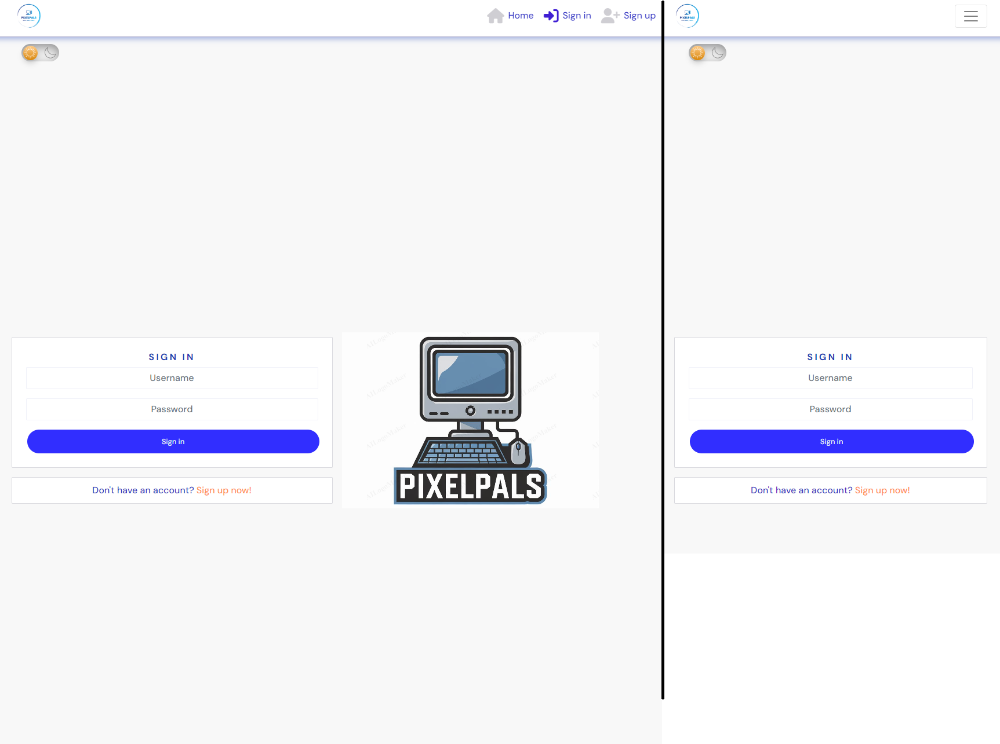
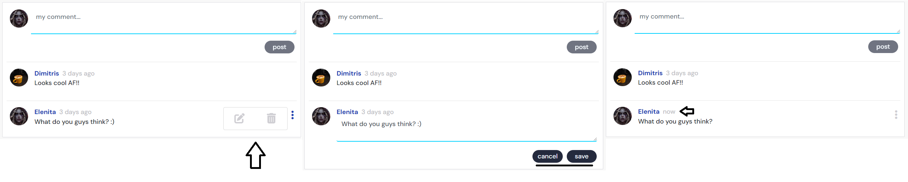

# PixelPals

Pixelpals is a Full-Stack web application that empowers users to share engaging content, drawing inspiration from popular social media platforms like Instagram. Leveraging Django Rest Framework for robust backend operations and React for a responsive frontend, Pixelpals delivers a smooth, intuitive experience for users to browse, create, and interact with captivating content.
 
 
Visit the website: [Pixelpals](https://pixelpals-pp5-ee2d5ecf265c.herokuapp.com/)
 

## Table of Contents

- [Pixelpals](#pixelpals)

  - [Live Site](#live-site)
  - [API Backend](#api-backend)
  - [The Strategy Plane](#the-strategy-plane)
    - [Development Goals and Corresponding User Stories](#development-goals-and-corresponding-user-stories)
    - [Learning Outcomes and Skill Development](#learning-outcomes-and-skill-development)
    - [Agile Planning and Development](#agile-planning-and-development)
      - [Project Tracking (GitHub Projects)](#project-tracking-github-projects)
      - [Epics](#epics)
      - [User Stories](#user-stories)
      - [MoSCoW Prioritization](#moscow-prioritization)
  - [The Structure Plane](#the-structure-plane)
    - [Wireframes](#wireframes)
  - [The Skeleton Plane](#the-skeleton-plane)
    - [Implemented Features](#implemented-features)
    - [Future Features](#future-features)
  - [The Surface Plane](#the-surface-plane)
    - [Design](#design)
    - [Technologies](#technologies)
  - [Testing](#testing)
  - [Deployment](#deployment)
    - [Heroku](#heroku-deployment)
    - [Local Deployment](#local-deployment) -[How to Fork](#how-to-fork) -[How to Clone](#how-to-clone)
  - [Credits](#credits)
    - [Content](#content)
    - [Acknowledgements](#acknowledgements)

## Live Site

[Pixelpals site](https://pixelpals-pp5-ee2d5ecf265c.herokuapp.com/)

## API Backend

[Pixelpals API README](https://github.com/Enzolita/pixelpals-backend/blob/main/README.md)

## The Structure Plane

### Wireframes

All Wireframe Images

 

Login/Signup

Posts Page

Post Page

Profile

Report

Log out

 

_[Back to Content](#table-of-contents)_

## The Skeleton

### Implemented Features:

List of existing features

 

**Defensive Features**

- Authorization checks - Keeping It Secure

  - Strong Authorization Checks: We’ve got layers of protection with JWT tokens and CORS headers. Only authorized users get in!
  - Access Control: Unauthorized? Sorry, but you’ll be sent packing. We always check your credentials before you get to see any user data.

- Form validation - Smooth and Error-Free Forms

  - Data Validation: We make sure your data is good to go, both on the frontend and backend.
  - Backup and default values

- Ready for Anything

  - Profile Pics: Don’t worry about broken images—default profile pictures have got your back.
  - Auto Profiles: Every new user gets a profile automatically. No null references.

- Error pages or as better known Oops! Pages

  - Error Pages: If you wander into the unknown, a “Page Not Found” error will guide you back on track.

**General Features**

  - Responsive Design: Looks Great Everywhere: Our site adjusts beautifully across all devices.
    Complete Control

  - User Interaction - Get Involved: Like, comment, follow—get the full experience based on your authorization status. Pixelpals administrator have superuser authority and manages full CRUD.

  - CRUD Operations: 
    - Create - users can register a new user account, authenticated users can create post(s) and create a comment(s)
    - Read - authenticated users can view their posts, comments, and their profile image.
    - Update - authenticated users can update their profile image, username and password, and edit and save comments, its title and save it.
    - Delete - authenticated users can delete their own comments and posts.

**SignIn/SignUp Page**  

Join the Fun: Creating an account is easy-peasy. After signing up, you’ll be whisked to the sign-in page. Already signed in? You’ll head straight to the home page.

**Navigation Bar**  
Always There for You: The navigation bar adapts to whether you’re signed in or not, and it looks great on any screen size.

**Profile Page**
 
Showcase Yourself: See detailed info about users, including posts, followers, and who they follow. If you follow them, it’s highlighted. Add personal touches with a dedicated info section. Follow or hide users unless it’s your own profile. All posts from the profile owner are displayed below. Click on the three dots and edit your profile, change username, change password

**Profiles Sidebar**
 
Popular Profiles: Check out the most followed profiles. Follow or unfollow with a click, and enjoy a sidebar that fits perfectly on any screen. The profile sidebar is always present on screens that are large enough. On smaller screens, it appears in a smaller section above the main content, and on certain pages it is removed.

**Posts page**
 
Endless Inspiration: Browse posts infinitely! Use the search bar to find posts by title or username. Use category to filter. See your personalized feed of posts from those you follow and liked posts. Blocked users won’t show up.

Follow/unfollow

Like/unlike

Darkmode / Lightmode

**Post Page**
 
Dive into Details: See all the nitty-gritty about a post, including comments. Edit or delete your posts easily. Tag posts with one category, and (once the bug’s fixed) multiple hashtags. The multi-hashtag feature is hidden for now due to [BUG#68](https://github.com/JaqiKal/pixavibe-frontend/issues/68). Like the category tagging, it offers a predefined list to select/deselect multiple hashtags. However, once a post is saved, you can't change the hashtags during edits. To avoid a bad user experience, we've temporarily hidden this feature in the belly of our scrumptious app.

Owner´s post(s), me, myself and I!

Edit Image, Title, Content, Category

Dropdown menu for edit and delete of individual post.

Edit Comments

**Report Form**
 
Get in Touch: Use our report form to reach out about any issues you're experiencing or feeling. A custom made modal will thank you for your message.

 

#### Typography

The main font used on the website is "DM Sans".

 

_[Back to Content](#table-of-contents)_
#### Reusable Component Design

This application emphasizes modularity and reusability. Each component is designed to function independently and can be easily repurposed in different contexts. Some components have multiple uses across the app and offer potential for further applications.

A selection of reusable components

 

**Asset component**

- Purpose: Display a media asset, such as images, spinner animations, and messages.
- Props: src, message, spinner
- Usage: `const Asset` is considered a reusable component and has been reused in: NotFound.js, PostCreateForm.js, PostPage.js, PostsPage.js, PopularProfiles.js, ProfilePage.js to display a spinner whenever content is loading.
- Potential uses: Loading spinners or media placeholders in any section of the application.

**Avatar component**

- Purpose: Display user profile images.
- Props: profile, owner, image
  Usage: `const Avatar` is considered a reusable component and has been reused in: NavBar.js, Comment.js, CommentCreateForm.js, Post.js and Profile.js to handle and import the avatar for the user
- Potential uses: User profile displays, comment sections, and anywhere a user image is required.

**Darkmode / Lightmode Component**

- Purpose: This component provides the functionality to toggle between dark and light themes across the application, enhancing user experience by allowing them to choose their preferred display mode. It saves the user's selection locally (e.g., using local storage or cookies) to maintain the chosen theme across sessions and page reloads.
- Props: setTheme: Function that toggles between light and dark modes. String representing the current theme, either "light" or "dark".
- Usage: The SeclectedTheme component is reusable and has been implemented in Header.js and SettingsPage.js to enable theme switching in the application interface.
- Potential uses: It can be utilized in any part of the application where users need the option to toggle between dark and light modes, such as the homepage, user profile settings, or dashboard interfaces.

**Comment**

- Purpose: Display a comment with options to edit or delete it if the current user is the owner.
- Props: id, content, owner and more.
- Usage:`const Comment`is considered a reusable component and has been reused in: PostPage.js to fetch comments related to the specific post.
- Potential uses: Blog post comments, forum threads, product reviews, and profile pages to display user comments.

**MoreDropdown Component**

- Purpose: Provide a dropdown menu for actions like editing and deleting items. 
- Props: handleEdit (function to handle the edit action), handleDelete (function to handle the delete action).
- Usage: `const MoreDropdown` has been reused in Comment.js, Post.js and ProfilePage.js to render the dropdown menu the enable the user to edit their data.
- Potential uses: Context menus for various content types that support edit and delete actions.

**Navbar**

- Purpose: Present a navigation bar for the application, including links and user authentication options. 
- Usage: const Navbar is a reusable component and has been reused in App.js to render the navbar on the entire website, regardless of the URL path.
- Potential uses: Could be adapted for use in different applications with minimal adjustments to routing and links.

**Post**
- Purpose: Display a specific post.
- Props: id, title, content, owner and more.
- Usage: const Post is a reusable component and has been reused in PostPage.js and PostsPage.js to display post data.
- Potential uses: Featured post component, list of popular posts, forum threads, or portfolio showcases.

**ProfileDataContext and CurrentUserContext**

- Purpose: Manage user and profile data across the application.
- Usage:
  - CurrentUserContext: Provides current user data.
  - ProfileDataContext: Provides profile data, such as popular profiles.
- Used in: Various components requiring user or profile data.
- Potential uses: Any component that needs to access or manipulate user-related state efficiently.

**Profile**
- Purpose: This component is designed to render a user profile with options for following/unfollowing and block/unblock based on the current user's interaction status with the profile.
- Props: profile, owner, image
- Usage: Can be used as a Community memeber widget, Author card in blog posts, Participant list in events pages. `const Profile*  is considered a reusable component and has been reused in: PopularProfiles.js to render the profiles in the popular profiles field.
- Potential uses: Highly reusable, convenient to use anywhere where you need to show the profile/user associated with a piece of content. Community member widget, author card in blog posts, participant list in events pages.

**Custom Hooks**
- useClickOutsideToggle
  - Purpose: Handle click outside events to toggle state.
  - Usage: Can be reused in any component that needs to handle click outside functionality.
- useRedirect
  - Purpose: Redirect users based on their authentication status.
  - Usage: Can be reused in any component that needs to handle user redirects based on authentication.

**Utility Functions**
- Utility functions (e.g., date formatting, data validation)
- Purpose: General-purpose functions that can be used across different parts of the application.

#### Tools and Services

List of Tools & Services

 

- [Am I Responsive?](http://ami.responsivedesign.is/) is used to show the website image on a range of devices.
- [Balsamiq](https://balsamiq.com/) is used to create wireframes.
- [CSS Validation Service](https://jigsaw.w3.org/css-validator/#validate_by_input) is used to check code ensuring that my CSS is error-free and adheres to the latest web standards.
- [DevTools](https://developer.chrome.com/docs/devtools) to help in edit pages on-the-fly and diagnose problems quickly.
- [Diffchecker - text](https://www.diffchecker.com/text-compare/) is used to check code snippets.
- [Favicon.io](https://favicon.io/) is used to create favicon.
- [Font Awesome](https://fontawesome.com/) is used for the iconography on the website.
- [Git](https://git-scm.com/) is used for version control.
- [Gitpod](https://gitpod.io) streamlines your development process by providing a pre-configured, cloud-based development environment that's instantly ready for coding.
- [Github](https://github.com/) is essential for version control, allowing you to track changes, collaborate with others (if applicable), and secure online code storage.
- [Google Dev Tools](https://developers.google.com/web/tools) is used during testing, debugging and styling.
- [Google Fonts](https://fonts.google.com/) is a catalog of free, open-source fonts. Used for typography.
- [Heroku](https://www.heroku.com) ia a platform for deploying and hosting web applications.
- [Look](https:www.looka.com) ia used for the logo and symbol.
- [Markup Validation Service](https://validator.w3.org/) is used to check code ensuring that my HTML is error-free and adheres to the latest web standards.
- [UXwing](https://uxwing.com/) is a provider of free icons free for commercial use.

 

_[Back to Content](#table-of-contents)_

 

_[Back to Content](#table-of-contents)_

### Deployment

This section has moved here: [https://facebook.github.io/create-react-app/docs/deployment](https://facebook.github.io/create-react-app/docs/deployment)

### `npm run build` fails to minify

This section has moved here: [https://facebook.github.io/create-react-app/docs/troubleshooting#npm-run-build-fails-to-minify](https://facebook.github.io/create-react-app/docs/troubleshooting#npm-run-build-fails-to-minify)